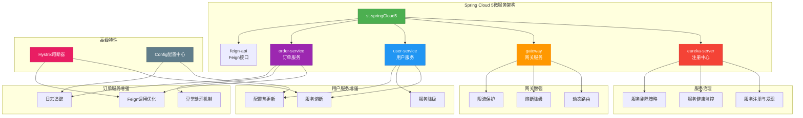

# st-springCloud5

> 🌐 Spring Cloud微服务学习项目（五）

本项目是Spring Cloud微服务架构学习的第五个阶段，进一步实践服务治理、配置管理和熔断降级等高级特性。

## 📊 项目架构图

```mermaid
graph TB
    subgraph "Spring Cloud 5微服务架构"
        A[st-springCloud5] --> B[eureka-server<br/>注册中心]
        A --> C[gateway<br/>网关服务]
        A --> D[user-service<br/>用户服务]
        A --> E[order-service<br/>订单服务]
        A --> F[feign-api<br/>Feign接口]
    end
    
    subgraph "服务治理"
        B --> G[服务注册与发现]
        B --> H[服务健康监控]
        B --> I[服务剔除策略]
    end
    
    subgraph "网关增强"
        C --> J[动态路由]
        C --> K[熔断降级]
        C --> L[限流保护]
    end
    
    subgraph "用户服务增强"
        D --> M[服务熔断]
        D --> N[服务降级]
        D --> O[配置热更新]
    end
    
    subgraph "订单服务增强"
        E --> P[Feign调用优化]
        E --> Q[异常处理机制]
        E --> R[日志追踪]
    end
    
    subgraph "高级特性"
        S[Hystrix熔断器] --> M
        S --> P
        T[Config配置中心] --> O
        T --> R
    end
    
    style A fill:#4CAF50,stroke:#2E7D32,color:#fff
    style B fill:#F44336,stroke:#C62828,color:#fff
    style C fill:#FF9800,stroke:#F57C00,color:#fff
    style D fill:#2196F3,stroke:#1565C0,color:#fff
    style E fill:#9C27B0,stroke:#6A1B9A,color:#fff
    style S fill:#E91E63,stroke:#C2185B,color:#fff
    style T fill:#607D8B,stroke:#455A64,color:#fff
```